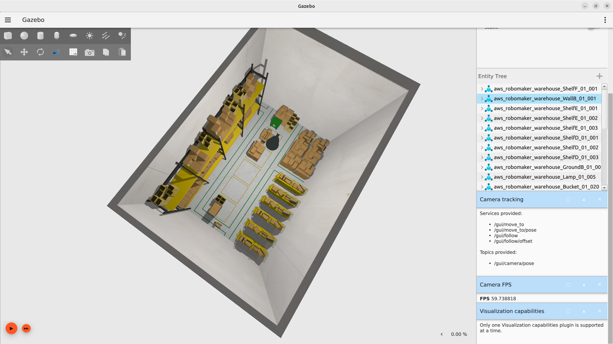
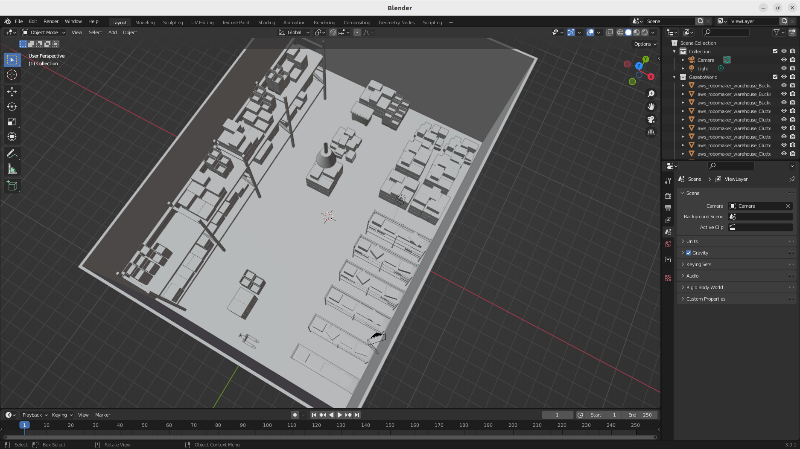
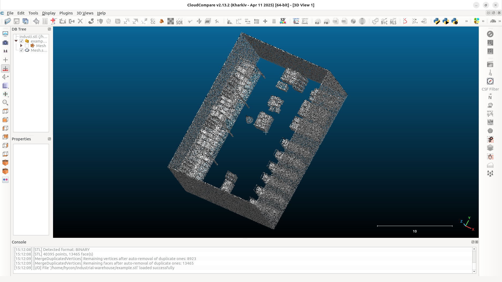
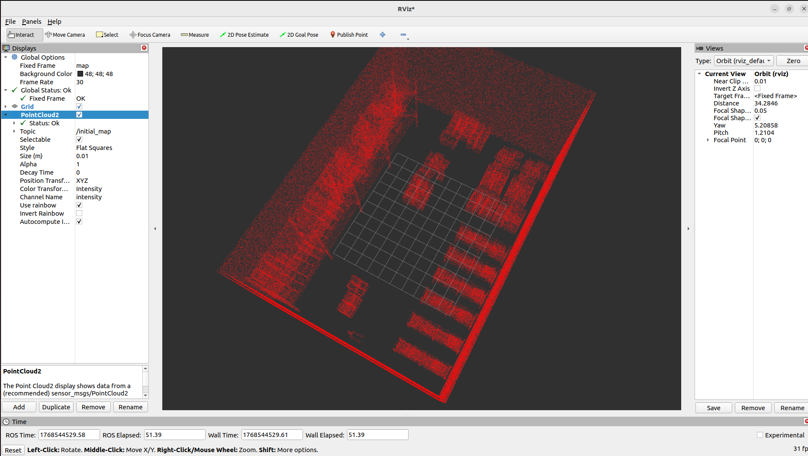

# sdf_to_blender
model import in Blender from SDF files

## Usage

Export **whole models** placed in Gazebo Sim's SDF files to Blender

Usually intended use in Gazebo Fuel

Since you loaded the fuel once, the model is already downloaded to your local machine. You can use this script to export the models to Blender.

### Why do this?

To make a Point Cloud Map from mesh files. With tools like [CloudCompare](https://github.com/CloudCompare/CloudCompare).

## Requirements

- Python3 (tested on Python 3.10.12)
- Blender(tested on Blender 3.02)
- Gazebo Sim(tested on Gazebo Fortress)

## How to use

1. Download World SDF file from Gazebo Fuel
2. Run the Gazebo Sim with downloaded World SDF file
  - this will download the models to your local machine
3. Run the script
4. Import the models into Blender
5. You can do whatever you want with the models in blender

*NOTE: STL is recommended when export mesh due to coordination system


### Example

The sdf file in repo is from [Gazebo Fuel](https://app.gazebosim.org/OpenRobotics/fuel/worlds/industrial-warehouse)

```bash
blender --python import_sdf_to_blender.py -- \
  --world industrial-warehouse/industrial-warehouse.sdf \
  --fuel-root ~/.ignition/fuel/fuel.ignitionrobotics.org \
  --axis-map sdf \
  --realize \
  --cleanup-sources
```

| Gazebo Sim | Blender |
| ---        | ---     |
|  |  |

| CloudCompare(edited) | RViz2 |
| --- | --- |
|  |  |